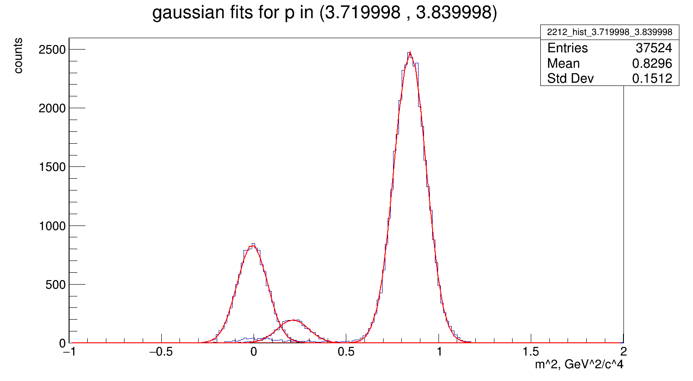
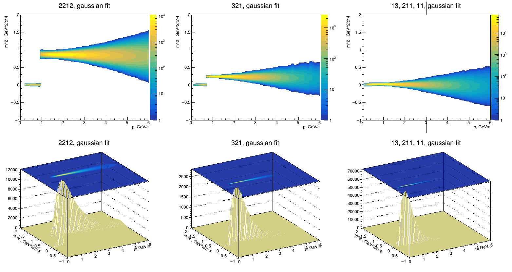
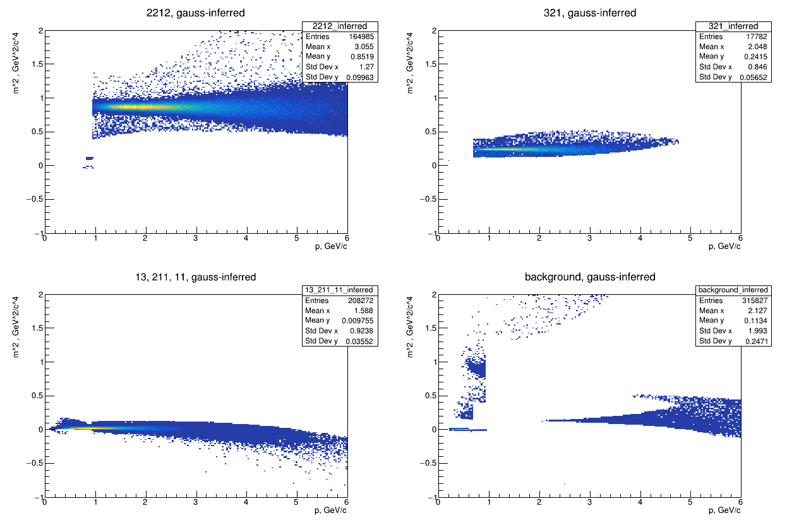
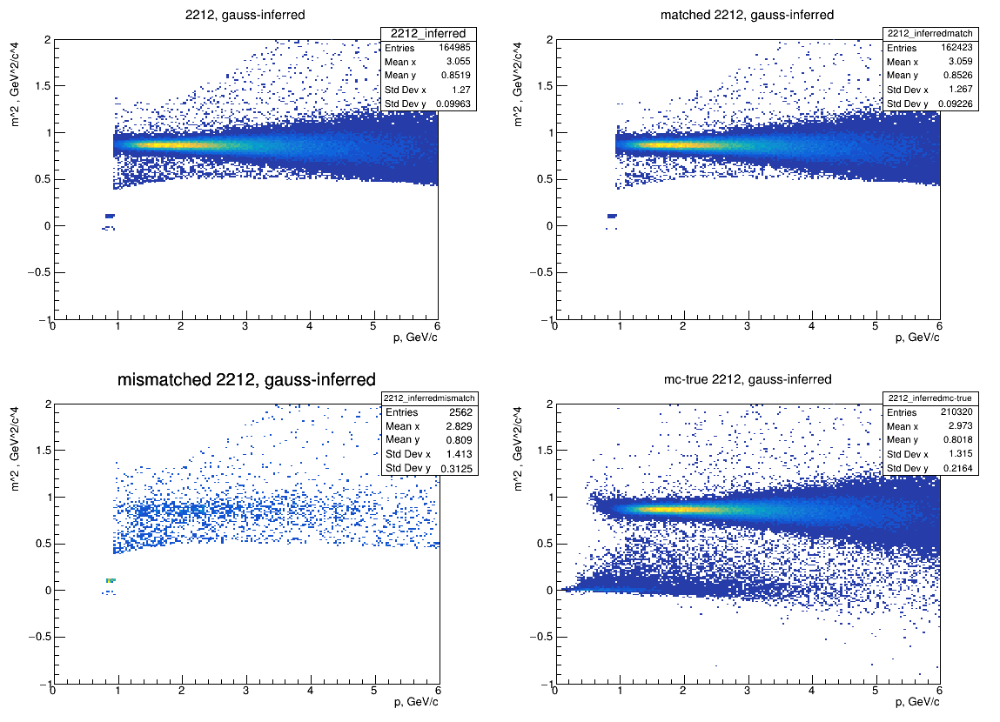

# Gauss PID

Particle identification using the gaussian method in the CBM experiment.

# Setup
Requires CMake, ROOT, AnalysisTree installations.

```
mkdir build && cd build
cmake .. -DCMAKE_INSTALL_PREFIX=<path-to-install-dir>
make -j install
```

then in the install directory:

```
cd bin
./gaus_fit 
./gaus_infer
```


# How it works

## Histogram fitting
Using momentum and mass information we can create a tof plot and separating the data into different particle peaks, fit gaussian functions to this data at different intervals in the momentum space (on fig. it is 50 momentum slices between 0 and 6 GeV/c).



We can combine many such functions into a smooth three dimensional function. One fuch 3d function corresponds to the probability distribution of one particle type in the mass-momentum phase space.



## Inference
### Bayesian Analysis

Given a particle with mass m and momentum p we can easily infer its probability across each particle class (reading from each probability distribution function). We take the largest function output and divide it by the sum of all function outputs. If the result is larger than a user-set threshhold, we classify the particle as that of the aforementioned class. Else, we discard it as background. Below we see the inferrence for protons (2212), kaons (321), and pions/electrons/muons(13/211/11).



### Verification

Because we are working with a simulation, it is easy to tell if a particle has been correctly or incorrectly identified. For example protons:



Moreover, we can define helper quantities: efficiency and purity, where

$$
\text{efficiency} = \dfrac{\text{All particles correctly identified as type X}}{\text{All simulated particles of type X}}
$$

$$
\text{purity} = \dfrac{\text{All particles correctly identified as type X}}{\text{All particles identified as type X}}
$$

Conducting such an analysis on this algorithm with a dataset of 100k events for histogram creation and 10k events for inference/quality analysis, we get:

```
Particle pdg: /2212
efficiency = 77.23%
purity = 98.45%

Particle pdg: /321
efficiency = 69.34%
purity = 77.69%

Particle pdg: /13/211/11
efficiency = 88.24%
purity = 90.36%
```